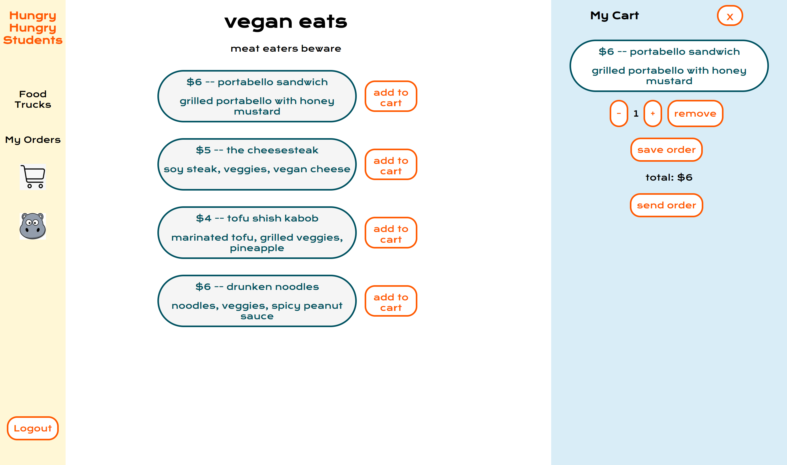

This project was bootstrapped with [Create React App](https://github.com/facebook/create-react-app).

## Project Plan

### Idea and Users

- What is the purpose of this app?
    - Hungry Hungry Students (HH-Students) is an app meant to help centralize food options on campus for busy (and hungry) students. It is also a platform where food truck owners can make their businesses available to students on campus.

- What are the problems your app is solving?
    - HH-Students will help eliminate long lines at food trucks during lunch time so students can get food quickly.

- How does it solve those problems?
    - Through HH-Students, students can order their food from an on-campus food truck online and then pick up their food when it's ready on their way to their next class or meeting. They can also save past orders so that ordering their lunch is even more streamlined and quick.

- Who is your target user?
    - University students.

- How much experience do they have with technology?
    - Moderate

### Features

MVP
<ul>
<li>login, logout, register a new account</li>
<li>select items from any menu to make a food order</li>
<li>confirm and pay for orders</li>
<li>save favorite orders</li>
<li>reorder saved favorite orders</li>
</ul>

Icebox features
<ul>
<li>see order history</li>
<li>a food truck owner version where they can manage their menus, receive orders and send notifications for completed orders</li>
</ul>

### Views/Routes
- login view (/)

- about view (/about)

- menu dashboard view (/dashboard)

- individual menu view (/menu/:menuId) 

- checkout sequence

- orders view (/myorders)

- order history view (/history)

- profile view (/profile)

### Component Tree

### Endpoints/Controllers

### Schemas/Queries/Database

